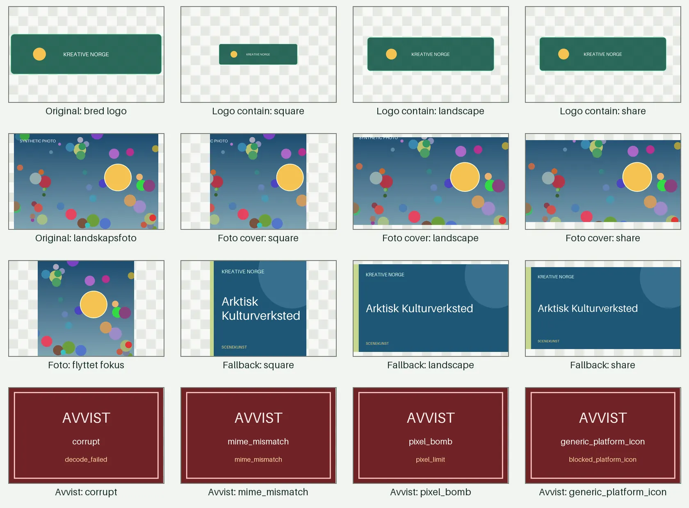

# Fase 3B.1: isolert bildebehandlings- og renditionprototype

**Dato:** 2026-07-31

**Status:** Teknisk gjennomført prototypeevidens. Prosjekteier har godkjent processing profile v1 og neste spikeavgrensning; åpne kvalitetsgrenser krever fase 3B.1R. Ikke produksjonsklar og ikke implementert i CRM.

**Arkitekturgrunnlag:** [ADR-007](../decisions/ADR-007-IMAGE_ASSET_ARCHITECTURE.md)

**Reproduserbar lab:** [`spikes/image_pipeline/`](../../spikes/image_pipeline/README.md)

**Visuell evidens:** [Kontaktark med 16 paneler](evidence/phase3b1-image-contact-sheet.webp)

Rapporten skiller mellom:

- **målt fakta:** resultat fra den isolerte spiken på oppgitt miljø
- **teknisk anbefaling:** Codex-anbefaling basert på målingene
- **godkjent beslutning:** prosjekteiers valg etter prototypen, lagret i [ADR-007](../decisions/ADR-007-IMAGE_ASSET_ARCHITECTURE.md#23-fase-3b1-godkjent-processingkontrakt-v1)
- **åpent valg:** må bevises eller avgjøres senere

Ingen modeller, migrasjoner, API-ruter, frontend, storagekonfigurasjon eller runtimeintegrasjon er aktivert. Ingen storageleverandør er valgt.

## 1. Executive summary

Spiken beviser at den avgrensede renditionkontrakten kan implementeres deterministisk med både Pillow og pyvips/libvips:

- JPEG-, PNG- og WebP-bytes kan sniffes, dekodes og valideres uten å stole på filnavn eller oppgitt MIME
- korrupt input, MIME-/bytes-mismatch, SVG og en trygg 10-milliarders pixelbomb-fixture avvises før renditionbruk
- EXIF-orientering normaliseres før crop, og sensitive metadata følger ikke offentlige varianter
- logo bruker `contain`, kontrollert 8 prosent padding og alpha uten kutt eller oppskalering
- foto bruker `cover`, sentrum eller normalisert fokuspunkt og korrekt crop uten stretching
- `square`, `landscape` og nøyaktig 1200 × 630 `share` genereres
- dynamisk Kreative Norge-fallback og tre små statiske nødvarianter genereres deterministisk
- samme Pillow-input og konfigurasjon ga identisk checksum, størrelse og metadata i tre kjøringer
- pyvips var omtrent dobbelt så raskt i de to syntetiske arbeidslastene, men Pillow var raskt nok og har lavere operasjonell kompleksitet

**Teknisk anbefaling:** Bruk Pillow som første produksjonsrettede MVP-bibliotek bak en liten intern adapter. Behold benchmarkkontrakten slik at pyvips kan vurderes på nytt dersom representative batcher viser at Pillow bryter avtalte ressursgrenser.

**Foreløpig formatanbefaling:** Godta JPEG, PNG og WebP som rasterinput. Bruk WebP for foto i `square`/`landscape`, PNG for logo med alpha og JPEG for `share`. Utsett AVIF og avvis SVG frem til egne kompatibilitets- og sikkerhetstester er godkjent.

Prosjekteier godkjente 2026-07-31 Pillow bak en intern adapter, det statiske JPEG-/PNG-/WebP-formatsettet, processing profile v1 og fase 3B.2-avgrensningen. Pixel-, dimensjons- og blurgrensene ble ikke endelig godkjent; de flyttes til representativ fase 3B.1R før fase 3C.

## 2. Testmiljø

### Målt lokalt

- macOS 26.5.2, ARM64
- Python 3.12.9
- [Pillow 12.3.0](https://pypi.org/project/pillow/12.3.0/)
- [pyvips 3.1.1](https://pypi.org/project/pyvips/3.1.1/) med binær libvips 8.18.4
- tre gjennomløp per backend og arbeidslast
- tre varianter per gjennomløp, totalt ni renditions per målerad

### Isolert Linux-kontroll

Den dedikerte lab-Dockerfilen bygget på `python:3.12-slim` ARM64 uten endring av produksjons-Dockerfilen. Alle 17 tester og full evidensregenerering var grønne i containeren. Eksplisitt pin-net `pyvips-binary` installerte libvips 8.18.4 uten systempakker.

Dockerens rapporterte peak RSS var lik 236 MiB på tvers av de korte child-prosessene og brukes derfor ikke til relativ biblioteksammenligning. Lokale separate prosessmålinger brukes i resultattabellen, og også de er retningsgivende, ikke kapasitetsplanlegging.

## 3. Biblioteker som ble prøvd

| Bibliotek | Praktisk resultat | Operasjonell vurdering |
| --- | --- | --- |
| Pillow 12.3.0 | Alle validerings-, render-, format- og determinismetester bestod | Ren Python-API over ferdige wheels, enkel å integrere og feilsøke; bruker mer tid og minne på det store fotoeksemplet |
| pyvips 3.1.1 / libvips 8.18.4 | Samme contain-/covervarianter ble generert deterministisk; omtrent dobbelt så raskt | CFFI og innpakket native libvips gir større operasjonell flate; den pin-nede binærpakken fungerte lokalt og i separat Linux-image |

Ingen avhengighet er lagt til rotens `requirements.txt`. Ingen av bibliotekene er koblet til Django.

## 4. Fixture-matrise

Alle fixtures er programmatisk genererte og har ingen eksterne bilde- eller rettighetskilder.

| Fixture | Bytes/format | Formål | Resultat |
| --- | --- | --- | --- |
| Kvadratisk transparent logo | PNG med alpha | vanlig logo/contain | Godkjent |
| Bred logo | PNG med alpha | ekstrem landskapslogo | Godkjent, ikke kuttet |
| Høy logo | PNG med alpha | ekstrem portrettlogo | Godkjent, ikke kuttet |
| Logo med liten tekst | PNG med alpha | lesbarhet etter skalering | Godkjent; ekte små navnetrekk må vurderes senere |
| Landskapsfoto | JPEG 2400 × 1600 | cover, fokus og benchmark | Godkjent |
| Portrettfoto | JPEG 1600 × 2400 | ulike aspect ratios | Godkjent |
| EXIF-orientering | JPEG, orientation 6 | normalisering før crop | Godkjent; 1800 × 1200 ble 1200 × 1800 |
| Metadatafoto | JPEG med description/artist | stripping | Godkjent; EXIF fjernet fra rendition |
| Lite bilde | PNG 120 × 80 | oppskalering | Dekodet, men avvist for 512-rendition uten oppskalering |
| Svært bredt bilde | JPEG 3000 × 500 | ekstrem ratio | Teknisk godkjent, dimensjonsreview |
| Svært høyt bilde | JPEG 500 × 3000 | ekstrem ratio | Teknisk godkjent, dimensjonsreview |
| Uskarpt bilde | JPEG 2400 × 1600 | edge-variance | Teknisk dekodet; hard-fail-kandidat i foreløpig kvalitetsmodell |
| Sterkt komprimert bilde | JPEG quality 7 | artefaktevidens | Dekodet; blurmålet alene oppdaget ikke komprimeringsartefakter |
| Korrupt fil | trunkert PNG | dekodingsfeil | Avvist: `decode_failed` |
| MIME-/bytes-mismatch | PNG-bytes oppgitt som JPEG | typeforfalskning | Avvist: `mime_mismatch` |
| Pixelbomb | 57-byte PNG med 100000 × 100000 IHDR | trygg ressursgrense | Avvist: `pixel_limit` før stor allokering |
| Generisk plattformikon | syntetisk PNG | policyblokkering | Avvist: `blocked_platform_icon` via eksplisitt semantic flag |
| PNG med alpha | PNG 1000 × 700 | vilkårlig transparens | Godkjent, alpha bevart |
| JPEG uten alpha | JPEG 1600 × 1000 | opaque raster | Godkjent |
| Syntetisk SVG | lokal tekst-SVG | vektorpolicy | Detektert og avvist: `svg_not_allowed` |

15 av 20 fixtures ble teknisk dekodet. De fem forventede policy-/sikkerhetsfixtureene ble avvist med riktig årsak.

## 5. Resultater for dekoding og validering

**Målt fakta:**

- faktisk format og MIME ble utledet fra bytes før Pillow-dekoding
- maksimal filstørrelse var 15 MiB i prototypen
- maksimal deklarert størrelse var 20 megapiksler
- pixelbomben ble stoppet av dekoderens bombebeskyttelse før pixeldata ble allokert
- byte-SHA-256 ble beregnet for alle godkjente kilder
- korrupte bytes og oppgitt MIME som ikke matchet bytes ble avvist
- EXIF-orientering ble brukt før fit/crop
- outputinspeksjon fant ingen EXIF-, ICC-, XMP- eller comment-metadata
- små bilder fikk ikke automatisk oppskalering

Generisk plattformikon ble avvist fordi fixtureen eksplisitt bar et semantic policyflag. Spiken beviser policygaten, ikke automatisk visuell klassifisering av Facebook-, TikTok- eller andre plattformlogoer.

## 6. Resultater for logo og `contain`

- `contain` bruker en gjennomsiktig canvas og kontrollert 8 prosent padding
- bred og høy logo ble sentrert uten crop og uten stretching i alle tre aspect ratios
- alpha ble beholdt i PNG og WebP
- renderer skalerer bare ned; liten logo forblir på opprinnelig størrelse
- liten tekst forble synlig i den syntetiske fixtureen, men denne spiken kan ikke fastsette en generell lesbarhetsgrense for ekte navnetrekk

Teknisk anbefaling er at logo/name mark bruker `contain`, mens et eget redaksjonelt reviewvarsel dekker svært liten tekst og stor intern whitespace.

## 7. Resultater for foto, `cover` og fokus

- foto bruker `cover` med aspect-korrekt crop før nedskalering
- sentrum `(0.5, 0.5)` er standard
- flyttet normalisert fokus `(0.82, 0.44)` ga et annet, stabilt square-utsnitt
- cropvinduet clamps til bildekanten og beholder target-aspect
- EXIF-orientering skjer før cropberegningen
- ingen variant strekkes
- cover av det lille 120 × 80-bildet til 512 × 512 ble blokkert fordi cropen bare var 80 × 80

Square, landscape og share kan ikke ha identisk pikselutsnitt. De bruker samme fokusintensjon og velger det gyldige cropvinduet for hvert aspect ratio.

## 8. Resultater for `square`, `landscape` og `share`

| Variant | Prototypestørrelse | Status |
| --- | --- | --- |
| `square` | 512 × 512 | Målt prototypeverdi; senere godkjent i processing profile v1 |
| `landscape` | 800 × 450 | Målt prototypeverdi; senere godkjent i processing profile v1; mobil detaljhøyde er fortsatt åpen |
| `share` | 1200 × 630 | Eksakt godkjent ADR-mål og verifisert |

Alle tre ble generert for contain-logo, cover-foto, dynamisk fallback og statisk nød-fallback.

## 9. Fallback-resultater

Den dynamiske prototypen bruker:

- aktørnavn
- valgfri hovedkategori
- deterministiske farger fra innholdet
- fast «KREATIVE NORGE»-avsender
- kontrollert teksttilpasning
- ingen plattformlogo

Samme input ga identiske bytes. Square-, landscape- og sharevariant ble generert. Tre statiske PNG-nødvarianter på henholdsvis 12 423, 11 510 og 17 174 bytes er committed i laben og kan brukes dersom dynamisk rendering feiler.

Visuell stil er bare funksjonell evidens og er ikke endelig designgodkjenning.

## 10. Determinismemålinger

Pillow kjørte samme foto, `share`, `cover`, fokus `(0.72, 0.44)`, JPEG-kvalitet og processing-version tre ganger:

- én unik filchecksum
- én unik filstørrelse
- ett unikt metadatasett
- identiske dimensjoner

Begge benchmarkbackends produserte også én checksum per variant gjennom tre gjennomløp. Kontrakten er byte-identisk output for pin-net bibliotek, format, source checksum, fit, fokus, variant, kvalitet og `processing_version`.

Immutable prototypekey inkluderer source checksum, processing-version og hash av canonical renderconfig. En endring i noen av disse verdiene skal gi ny key og ikke overskrive historisk output.

## 11. CPU-, minne-, tids- og filstørrelsesmålinger

Dette er faktiske separate prosessmålinger på lokal ARM64-Mac. Peak RSS inkluderer bibliotekimport og dekoderens high-water mark. Tallene er små-fixtureevidens, ikke produksjonsestimat.

| Arbeidslast | Backend | Veggtid/rendition | CPU/rendition | Peak RSS | Gjennomsnittlig output |
| --- | --- | ---: | ---: | ---: | ---: |
| Logo contain, 3 varianter × 3 | Pillow | 12,378 ms | 12,367 ms | 46,453 MiB | 17 365 bytes |
| Logo contain, 3 varianter × 3 | pyvips | 6,025 ms | 8,355 ms | 57,734 MiB | 15 367 bytes |
| Foto cover, 3 varianter × 3 | Pillow | 19,053 ms | 18,965 ms | 102,844 MiB | 40 963 bytes |
| Foto cover, 3 varianter × 3 | pyvips | 8,970 ms | 11,830 ms | 63,688 MiB | 40 890 bytes |

pyvips var 2,05 ganger raskere for logo og 2,12 ganger raskere for foto i veggtid. Pillow brukte mindre peak RSS for logo, mens pyvips brukte mindre for det større fotoet. Batchen var bare ni renditions per rad og sier ikke noe sikkert om købehov eller titusenvis av aktører.

## 12. Formatvurdering

Alle fire encodere var teknisk tilgjengelige i begge bibliotekene. Størrelsene under gjelder én syntetisk 512-square for foto og én 800 × 450 contain-logo.

| Format | Foto | Logo | Observasjon |
| --- | ---: | ---: | --- |
| JPEG | 27 282 bytes | 24 689 bytes | bred kompatibilitet; mister alpha |
| PNG | 51 627 bytes | 16 169 bytes | tapsfri og stabil alpha; stor for foto |
| WebP | 8 468 bytes | 8 866 bytes | klart mindre i fixtureene og bevarer alpha |
| AVIF | 6 004 bytes | 3 949 bytes | minst i fixtureene, men ikke testet mot sosial deling, eldre klienter eller operasjonell støtte |

JPEG, PNG og WebP er et realistisk minimumssett. AVIF-resultatet beviser bare lokal encoding/decoding og låses ikke i kontrakten.

## 13. SVG-vurdering

- Pillow har ingen SVG-dekoder i denne laben
- den installerte pin-nede pyvips/libvips-binærpakken rapporterte ingen `.svg`-loader
- syntetisk SVG ble korrekt identifisert som `image/svg+xml` og avvist
- ingen ekstern rasterizer, shellkommando eller XML-tolk ble introdusert

**Teknisk anbefaling:** Første MVP avviser SVG med forklarlig feil. En senere separat sikkerhetsspike kan sammenligne resvg eller en annen sandboxet rasterizer hvis reelle kildebilder viser behov. SVG skal ikke aktiveres ved bare å installere et tilfeldig systemverktøy.

## 14. Foreløpige terskelanbefalinger

### Verdier brukt i prototypen

- filstørrelse: 15 MiB; senere godkjent som konfigurerbar standardverdi
- pixelgrense: 20 megapiksler; ikke godkjent som endelig grense
- bare faktisk dekodbar JPEG, PNG eller WebP i første MVP
- oppgitt MIME må matche bytes
- SVG og ukjent format avvises
- cover-rendition avvises dersom korrekt crop er mindre enn målvarianten
- ingen automatisk oppskalering

### Ikke-godkjent prototype for dimensjonsmodell

- korteste side under 160 piksler: hard fail for offentlig rendition
- korteste side 160–511 piksler: review
- minst 512 piksler: generell dimensjonspass, men hver variant må fortsatt bestå sin egen no-upscale-kontroll

### Ikke-godkjent edge-variance-prototype

- under 5: hard-fail-kandidat
- 5–24,999: manuelt review
- 25–99,999: varsel
- 100 eller mer: pass på blurindikatoren

Det syntetiske skarpe fotoet målte 437,687; blurfixtureen 2,741. Sterkt komprimert JPEG målte 463,917 og viser at blurindikatoren ikke oppdager komprimeringsartefakter. Ingen blurgrense må aktiveres som endelig hard fail før et representativt, kontrollert datasett er evaluert.

## 15. Risiko og begrensninger

- Fixtureene er syntetiske og dekker ikke ekte ansikter, vannmerker, plakater, små sponsorlogoer eller varierende fotografisk støy.
- Plattformikonblokkering bruker et eksplisitt flagg; automatisk gjenkjenning er ikke bevist.
- Ingen reell ondsinnet polyglot, animert fil, fargeprofil eller uvanlig JPEG er testet.
- AVIF er bare teknisk probet og ikke testet mot offentlig klient- og delingskompatibilitet.
- SVG er bevisst avvist; rasterizer er ikke valgt.
- Peak RSS er en prosess-high-water-måling, ikke en nøyaktig per-operasjon allokeringsprofil.
- Ingen flerprosess-, kø-, samtidighets- eller storbatchtest er gjennomført.
- Ingen storage, S3, CDN, purge, backup eller restore er prøvd i 3B.1.
- Fallbackens typografi kommer fra pin-net Pillow-standardfont og er ikke endelig visuell profil.
- macOS ARM64 og Linux ARM64 ble kontrollert; GitHub CI skal gi separat Linux x64-evidens på PR-en.

## 16. Anbefalt bildebehandlingsbibliotek

**Teknisk anbefaling fra prototypen:** Pillow 12.3.0 for første MVP. Prosjekteier godkjente bibliotekretningen, men ikke en permanent binding til denne konkrete versjonen; se punkt 18.

Begrunnelse:

- bestod alle nødvendige sikkerhets-, metadata-, fit-, fokus-, format- og determinismetester
- 12–19 ms per rendition er tilstrekkelig for denne avgrensede, forhåndsbehandlede CRM-flyten
- enklere dependency-, Docker-, feilsøkings- og sikkerhetsflate enn CFFI/native libvips
- innebygd bombebeskyttelse og EXIF-/formatstøtte ga en direkte implementasjon
- kan plasseres bak en liten adapter slik at pyvips senere kan overta uten å endre domene- eller storagekontrakten

pyvips er det målte ytelsesvalget og bør revurderes dersom representative batcher viser for høy Pillow-latens/minnebruk eller dersom behandling flyttes til dedikerte workers.

## 17. Anbefalt minimumsformatsett

**Anbefaling fra prototypen, senere godkjent som processing profile v1 i punkt 18:**

- input: JPEG, PNG og WebP
- foto `square` og `landscape`: WebP, quality 82
- foto `share`: JPEG, quality 85, ingen progressiv encoding i første deterministiske kontrakt
- logo med alpha: PNG; WebP-alpha kan vurderes som tillegg senere
- fallbackkort: WebP; share-fallback: JPEG
- AVIF: åpent, ikke MVP-krav
- SVG: avvist i MVP

Alle outputformater skal strippe sensitive metadata. Format og encoderinnstillinger inngår i processing-version og immutable key.

## 18. Prosjekteiers godkjenning etter prototypeanbefalingene

Prosjekteier godkjente 2026-07-31 følgende som tekniske beslutninger i [ADR-007](../decisions/ADR-007-IMAGE_ASSET_ARCHITECTURE.md#23-fase-3b1-godkjent-processingkontrakt-v1):

- Pillow er primær MVP-backend bak en liten intern adapter. pyvips/libvips beholdes som ytelsesalternativ hvis representative batcher senere bryter godkjente ressursgrenser.
- Produksjonsavhengigheten skal pin-nes og verifiseres når den innføres; valget er ikke låst til Pillow 12.3.0.
- Global `Image.MAX_IMAGE_PIXELS` skal ikke muteres per request eller parallell operasjon. Pixelbeskyttelsen må være trådsikker, prosessfast eller isolert.
- Første MVP støtter bare statiske JPEG-, PNG- og WebP-input. SVG, påkrevd AVIF-input, GIF, HEIC/HEIF, TIFF, ukjente formater og animerte WebP-filer avvises forklarlig. Ingen animert fil reduseres stilltiende til første frame.
- `square` er 512 × 512, `landscape` er 800 × 450 og `share` er 1200 × 630.
- Foto bruker WebP quality 82 for `square`/`landscape` og ikke-progressiv JPEG quality 85 for `share`; logo med alpha bruker PNG; dynamisk fallback bruker WebP, mens share-fallback bruker JPEG.
- Format, encoderinnstillinger, source checksum, fit, fokus, variant og processing-version inngår i immutable key. Endret verdi gir ny key og overskriver aldri historisk output.
- Logo bruker `contain`; foto bruker `cover` og normalisert fokus med sentrum som standard. EXIF-orientering skjer før crop, og sensitive metadata fjernes fra offentlige renditions.
- Ingen kildepiksler skaleres automatisk opp. For svak kilde håndteres med bedre kilde, annet bilde eller kontrollert Kreative Norge-komposisjon/fallback.
- Maksimal kildefilstørrelse 15 MiB er godkjent som konfigurerbar standardverdi.
- Fase 3B.2 ble godkjent som neste isolerte storage-, immutable-key-, purge-, deny- og restorelab. Den ble senere teknisk gjennomført, og prosjekteier godkjente de leverandøruavhengige prinsippene 2026-08-01 som dokumentert i [fase 3B.2-rapporten](PHASE_3B2_STORAGE_RESTORE_SPIKE.md) og ADR-007.

AVIF er ikke et MVP-krav. Rå SVG skal ikke serveres offentlig. En separat sikker rasterizerspike kan vurderes senere, og SVG-behovet skal vurderes på nytt før storstilt logoimport eller legacyovergang dersom mange offisielle logoer bare finnes som SVG.

Fase 3B.1 beviste metadatafjerning, men ikke en eksplisitt sRGB-normaliseringskontrakt. Denne må testes før fase 3C.

Følgende prototypeverdier ble uttrykkelig ikke godkjent som endelige produktgrenser:

- 20 megapiksler som endelig pixelgrense
- en universell korteste-side-modell med hard fail under 160, review 160–511 og pass fra 512
- edge variance under 5 som automatisk hard fail
- de øvrige edge-variance-/blurintervallene

Blur-/edge-variance er foreløpig bare varsel, reviewprioritering og diagnostikk. Dimensjonsregler må vurderes per bildetype, fit, variant, reelt cropområde og oppskaleringsbehov.

## 19. Valg som fortsatt må bevises senere

- endelig pixelgrense og representative dimensjons-, crop-, blur-, komprimerings- og logolesbarhetsregler
- om outputkontrakten trenger ekstra kompatibilitetsfallback ved siden av processing profile v1
- om AVIF gir nok gevinst til å forsvare klient-, drift- og cachekompleksitet
- eventuell trygg SVG-rasterizer
- køgrense, samtidighet, timeout og reell storbatchprofil
- fargeprofilnormalisering til eksplisitt sRGB
- automatisk oppdagelse av plattformlogo, vannmerke, datoplakat og irrelevant bilde
- mobil detaljhøyde
- endelig fallbackdesign og fontasset
- prosesseringsadapterens konkrete runtimeplassering

## 20. Fase 3B.1R: representativ kvalitetsvalidering

Før fase 3C skal et lite, rettighetsavklart sett med ekte brede og høye logoer, logoer med liten tekst og mye whitespace, portretter, gruppebilder, mørke scene-/konsertbilder, komprimerte nettsidebilder, plakater og årstall, vannmerker, høyoppløselige mobilbilder og reelle ICC-/fargeprofiler testes.

Fase 3B.1R skal brukes til å fastsette pixelgrense, dimensjonsregler per reelt renditionbehov, blur-/komprimeringsvarsler, lesbarhetsvarsler for logo og eventuell begrenset kvalitetsregel. Delsteget blokkerer ikke fase 3B.2, men må være gjennomført og godkjent før fase 3C.

## 21. Opprinnelig avgrensning for fase 3B.2

Etter fase 3B.1 var neste godkjente og avgrensede scope en isolert **storage-, immutable-key-, purge-, deny- og restorelab**:

1. separate navngitte private/public `STORAGES`-aliaser uten å endre default storage
2. lokal filesystemreferanse og én disponibel S3-kompatibel testbackend
3. immutable renditionkeys fra processing profile v1
4. privat original versus offentlig rendition og absolutte allowlistede media-origins
5. origin-sletting, purge/takedown og ny key ved restore
6. varig deny-journal som vinner over eldre database-/object-storage-backup
7. deterministisk regenerering versus direkte renditionbackup
8. statisk fallback når storage eller dynamisk renderer feiler

3B.2 skulle ikke opprette CRM-bildemodeller, migrasjoner, aktive API-ruter, OpenAPI-schema, Editor, PUBLIC, selection-concurrency, Import 2.0-integrasjon, bakgrunnskø eller stagingdeploy. Dette ble fulgt i den senere prototypen. API-schema, aliasmapping, selection-concurrency og køgrense er fortsatt senere fase 3B-gater etter storageevidensen.

## 22. Eksplisitt avgrensningsbekreftelse

Fase 3B.1 har ikke:

- opprettet `ImageCandidate`, `ImageAsset`, `OrganizationImageSelection`, `ImageRendition` eller `ImageReviewEvent`
- opprettet eller kjørt migrasjoner
- endret `Organization`-bildefelter, serializers, views, ruter eller OpenAPI
- endret Editor, PUBLIC, aktiv Open Graph-flyt eller public API
- endret root `requirements.txt`, produksjons-Dockerfil eller default storage
- hentet eksterne bilder, brukt Brave eller kontaktet aktørnettsteder
- endret database, publiseringsflagg, staging eller produksjonsdata
- deployet eller merget prototypekoden

Spiken er reproduserbar teknisk evidens. Prosjekteier har godkjent bibliotekretningen, formatmappingen, processing profile v1 og fase 3B.2-scope. Storage-/restoreprinsippene ble senere godkjent 2026-08-01. Fase 3B.1R, provider-/driftsgaten og øvrige åpne fase 3B-gater må fortsatt gjennomføres og godkjennes før fase 3C.
